# Chapter 4

# RESULTS AND DISCUSSION

## 4.1 Program Description

The Real-Time PEME Monitoring and Result Access System is a web-based information system developed for American Hospital Inc. (AHI) to address the operational, communication, and compliance gaps observed in its Pre-Employment Medical Examination (PEME) workflow. As established in Chapters 1 through 3 of this manuscript, AHI's existing process relies heavily on manual coordination between reception, the triage station, individual examining departments, the physician, and the releasing counter. This manual orchestration is the documented source of the queue collation incidents, the misrouted or lost result slips, and the delayed turnaround that the proponents quantified in the problem statement. The program described in this section is the proponents' bespoke software response to those problems and represents the actual build state of the system at the time of writing rather than the full conceptual scope outlined in Chapter 3.

At its highest level, the program is a single multi-tenant web application that gives each PEME stakeholder a role-specific workspace built on top of a shared case record. A patient, an AHI staff member, a partnering manpower agency representative, and the system administrator all access the same deployed application through a browser, but each is routed by the system to a workspace that exposes only the data and actions appropriate to their role. The case record itself moves through a defined operational lifecycle — registered, in progress, pending additional tests, for decision, for releasing, released, and archived — and each role's workspace is structured around the slice of that lifecycle for which it is responsible. By centering the design on a single source of truth for each PEME case rather than on a chain of paper slips and verbal handoffs, the program removes the conditions that previously produced collation errors and untraceable result handovers.

The program is implemented as a three-tier cloud-native single-page application. The presentation tier is built with Next.js 15 (App Router) and React 19, styled with Tailwind CSS 4 and a small set of accessible Radix UI primitives, and rendered as role-aware dashboards on top of a shared dashboard shell. The application tier is provided by Supabase, which exposes authenticated REST endpoints, server-side session handling, and PostgREST-style row access on top of a PostgreSQL database. The data tier is a PostgreSQL schema of twelve tables grouped into core operational data (patients, companies, PEME cases, department visits, result items, decisions), security and audit data (user accounts, roles, audit log), and configuration data (departments, packages, status codes). Authorization is enforced at the database layer through Row-Level Security policies and is mirrored at the route layer through middleware guards, so a role cannot cross into another role's data even if the frontend were to be tampered with. This split — frontend convenience checks for usability, database policies for actual enforcement — is consistent with the security posture committed to in Chapter 3.

The functional scope of the program covers the end-to-end PEME workflow as it actually exists inside AHI. Reception and Billing personnel use the system to search the patient registry, register new patients, and create a new PEME case under a contracted company and an assigned examination package. Case creation automatically generates the required department visits derived from the chosen package, sets the case to a registered state, captures whether the patient has signed the data privacy waiver, and records the action in the audit log. The Triage Nurse module surfaces a queue of cases that have been registered but not yet triaged, supports a rush-first ordering for urgent agency requests, and accepts the recorded vitals and observations that move a case from registered to in-progress. Examining departments — for example radiology, laboratory, or dental — each operate a department-scoped queue table with manual status progression: pending visits are pulled by staff one at a time, marked in-progress, encoded with results, and completed, with a separate skip-and-requeue path available for visits that must be temporarily set aside. The result-encoding form is driven by a seeded Test Catalog of approximately sixty clinical and laboratory tests grouped by category, each with sex-aware reference ranges and units; the catalog replaces the previously freeform text entry with a typeahead dropdown that auto-fills the unit and reference range, auto-detects abnormal values on blur, and surfaces a required-tests progress panel that itemizes which package-required tests are still outstanding for the visit. The hybrid package-fence rule — required tests cannot be removed, but off-package extras are always allowed — preserves the package contract while letting department staff add clinically relevant extras on the same visit. Once all required visits are complete, the case becomes available to the Physician module, which presents a consolidated read-only summary of the patient, the package, and every department's encoded results, and allows the physician to render a fitness decision (Fit, Unfit, or Fit With Restrictions) along with remarks, or to send the case back into the workflow by requesting additional tests. Cases bearing a finalized decision then arrive at the Releasing Staff module, which gates release behind a checklist confirming that all required visits are complete and that a decision exists, captures the release timestamp, and controls the toggle that determines whether a released case is visible to the patient and the partnering agency. Each of these write actions is recorded in an audit log together with the acting user, the affected case, and a timestamp. The five staff modules together form the operational backbone of the program and are the components that have been fully implemented and tested at the time of this draft.

Alongside the staff workflow, the program provides a System Administrator workspace for governance. From this workspace, the administrator manages user accounts and role assignments, edits reference data (departments, packages, package-to-department mappings, status codes, and companies), inspects the audit log through a filterable viewer, and governs the Test Catalog and its package-to-test mapping. This module is the operational counterpart to the security and configuration tiers of the data model and is what allows the system to be maintained day-to-day without requiring direct database access. The administrator workspace is also the surface through which compliance-relevant settings — for example, locking a compromised account or revoking a role — are applied.

External-stakeholder access is mediated by two further workspaces that operate under stricter visibility rules. The Patient portal allows a registered patient to authenticate, view the progress of their own PEME case across the required examinations, and read the released summary of their results once releasing has been completed. Visibility of the released summary is conditioned on the same gates enforced by the releasing staff workflow, so a patient can never see results for a case that has not been formally released. The Client Representative portal — used by the manpower agencies that send applicants for examination — exposes only those cases belonging to the representative's own company, only when those cases are in the Released state, only when the portal-visible flag has been set, and only when the data privacy waiver has been signed by the patient. This four-condition gate is the program's operational implementation of the Data Privacy Act commitments described in Chapter 3 and is enforced both at the application layer and at the database layer.

Underlying these workspaces is a set of cross-cutting capabilities that the program treats as platform features rather than role features. Authentication is provided by Supabase Auth and is supported by a fifteen-minute idle session auto-timeout, password reset flows for both patient and staff accounts, and rate limiting on the sign-in endpoints to mitigate credential-stuffing attempts. File handling for diagnostic artifacts (for example scanned laboratory result sheets or imaging summaries) is implemented on top of Supabase Storage with role-scoped Row-Level Security and short-lived signed URLs, so a result file uploaded by a department staff member cannot be read by an unauthorized role; a maintenance script periodically sweeps orphaned upload artifacts whose owning result item was rolled back, and result-item writes are made idempotent so that an interrupted save cannot produce duplicate items on retry. Realtime visibility of queue state is provided by a lightweight subscription layer composed of a `useRealtimeRefresh` hook and a `RealtimeBridge` component, which together attach Postgres-changes channels to the cases, department visits, and result items tables and trigger a debounced server-component refresh whenever a relevant row changes; the bridge is wired into the Reception, Triage, Department (scoped to the staff member's department), Physician, Releasing, and Patient surfaces so that operators see new and updated work without having to manually reload the page. Outbound notifications are delivered through a Nodemailer-based SMTP transport using three PHI-minimal plain-text templates (case released, decision recorded, account locked), dispatched in a fire-and-forget pattern from the release and physician-decision actions so that a transport failure cannot block the primary write, and every send attempt produces an `EMAIL_SENT`, `EMAIL_FAILED`, or `EMAIL_SKIPPED` audit entry that can be reviewed later from the audit-log viewer. Audit logging is implemented across login attempts, case creation, status transitions, release actions, and the email pipeline above, providing the forensic trail required by both the institutional review and the privacy framework. The codebase is supported by a Vitest unit-test baseline, Playwright end-to-end coverage for the role-routing paths, an OWASP ZAP baseline scan script, and a continuous-integration workflow on GitHub Actions that runs the test and lint suite on every push, all of which are described further in the Project Capabilities and Limitations section of this chapter.

A small number of capabilities described in the Chapter 3 design remain out of scope for the version of the program documented in this draft and are explicitly identified here so that the program description is not read as overstating the build. Automated PDF certificate generation for released cases is deferred — the certificate-download entrypoint, the server action that authorizes and validates the download, and the storage-path scoping are implemented; only the PDF renderer itself is deferred, pending the official AHI certificate template. The administrative deployment-authorization workflow tracked under the project's sprint records as SCRUM-38 — which formalizes the production-release sign-off path — is also pending and is not yet exercised by the application. Parental or guardian consent handling for patients under the age of eighteen, which the Chapter 3 design identifies as a privacy-side concern, has not yet been added to the registration flow and is recorded as future scope. The patient-portal data-privacy acknowledgement is currently maintained as a per-session query-state value rather than as a persisted per-user acknowledgement, and the migration to persisted acknowledgement storage is similarly pending. These four items are tracked as named work items in the project's sprint records and will be revisited in the Project Capabilities and Limitations and Summary of Findings sections of this chapter.

Taken together, the program as described above operationalizes the central premise of the study: that the PEME workflow at AHI is best supported by a role-aware, audit-logged, lifecycle-driven web application that replaces the manual collation of paper records with a shared digital case record and a set of disciplined state transitions. The program directly addresses the queue-coordination problems, the lost-or-misrouted-result problems, and the slow turnaround problems that motivated the study, and it does so within the privacy and security commitments stated in Chapters 1 through 3.

## 4.2 System Requirements

The system requirements that drove the build are documented in full in Chapter 3 and are not reproduced here. The functional requirements — role-based access for the eight actor categories, end-to-end case lifecycle management, audit logging on every sensitive write, DPA-gated external visibility, and a queue-driven manual-pull workflow for each examining department — are the same requirements that the program described in Section 4.1 satisfies. The non-functional requirements — fifteen-minute idle session auto-timeout, ten-per-minute IP-scoped rate limiting on the authentication endpoints, role-scoped Row-Level Security on every data table, encryption in transit, file-upload type and size restrictions, and Realtime queue updates without manual page reloads — are likewise built and verified by the QA baseline. Where the as-built program differs from the Chapter 3 requirement set, the difference is enumerated in Section 4.4 (Project Capabilities and Limitations) so that the manuscript reviewer can see, at a glance, exactly which design commitments are honored, which are deferred, and which are out of scope.

## 4.3 Screen Hierarchy

### 4.3.1 Design Rules Followed in the Interface

Before walking through the individual screens of the system, this subsection states the interface design rules under which every screen of the program was constructed. The proponents adopted Shneiderman's Eight Golden Rules of Interface Design as the governing framework. Shneiderman's rules were selected over alternative heuristics because they are explicitly written for high-stakes, transactional, role-based information systems — the same interaction profile as a hospital examination workflow — and because each rule maps cleanly to a property that is observable and testable in the program's user interface. Where useful, the rules are complemented by selected Nielsen heuristics (notably visibility of system status and error prevention), but Shneiderman's framework is the primary reference. The rules and the program-level commitments associated with each are the following.

**Strive for consistency.** Every authenticated workspace in the program is rendered through a single shared dashboard shell composed of a top header, a left navigation rail, a main content panel, and an optional context side panel. Recurring elements such as metric cards, data tables, action panels, status badges, role badges, empty states, error states, and loading skeletons are implemented once as shared components and reused across all five staff modules, the administrator module, and both external portals. Terminology is also kept consistent: a case is always referred to as a case, a visit always as a visit, and the lifecycle states use the same wording on every screen on which they appear.

**Seek universal usability.** The shell is responsive across desktop, tablet, and mobile widths; the navigation rail collapses on narrower viewports while preserving access to Dashboard, Account, and Sign-Out. The components are built on Radix UI primitives, which provide keyboard navigability and screen-reader-friendly semantics out of the box, and the type system enforces visible focus states on every actionable control. Color choices are constrained to maintain contrast that meets the accessibility baseline stated in the layout specification.

**Offer informative feedback.** Every write action in the program — case creation, triage submission, visit completion, decision recording, and release — produces an explicit success or failure response. Inline validation messages are attached directly to form fields, and toast notifications surface the result of asynchronous operations. Status badges on cases and visits give immediate visual feedback on lifecycle position, and audit entries are written for every sensitive action so that the system's response is also recorded for after-the-fact review. In addition, the Realtime subscription layer described in Section 4.1 auto-refreshes Reception, Triage, Department, Physician, Releasing, and Patient surfaces whenever a relevant case, visit, or result item changes in the database, so the feedback a user sees is current to the underlying record rather than to the last manual reload.

**Design dialogs to yield closure.** Each role workflow is structured so that a unit of work has a clear beginning and end. Reception's case creation flow ends with a generated case number and a confirmation panel; triage's assessment flow ends with a state transition to In-Progress and a stamped completion time; the physician's decision flow ends with a recorded decision and a transition to For-Releasing; releasing ends with a release timestamp and a portal-visibility decision. The user is never left wondering whether the action they took was final.

**Prevent errors.** Status-transition controls are only rendered when the current state allows the transition, so a user cannot, for instance, attempt to release a case that has not yet received a physician decision. Required fields are validated before submission, package-derived department visits are auto-generated rather than typed by hand, and the data-privacy waiver gate prevents the agency portal from ever surfacing a case that has not satisfied the four required conditions.

**Permit easy reversal of actions.** Where reversal is operationally meaningful, the program provides it: reception may soft-cancel a case while it is still in an early lifecycle state, department staff may skip and requeue a visit rather than completing it incorrectly, and the releasing staff may toggle portal visibility off with a mandatory reason. Where reversal would compromise auditability — for example, reversing a finalized physician decision or un-releasing a released case — the program intentionally does not permit silent rollback and instead requires a forward-moving corrective action that is itself audit-logged.

**Keep users in control (internal locus of control).** The case workflow is built around a manual-pull queue model rather than around an automated routing engine. Department staff explicitly pull the next visit, the triage nurse explicitly progresses a case, the physician explicitly issues a decision, and the releasing staff explicitly releases. The system supports the user, but the user — not an opaque algorithm — drives every state transition.

**Reduce short-term memory load.** The physician's decision screen consolidates the patient, package, and per-department results into a single read-only summary so the physician does not need to remember what was encoded on a previous screen. The reception case list, the triage queue, the department queue, the releasing queue, and both external portals expose filters and search rather than expecting the user to scan long lists from memory. Every page exposes a role badge and a clear page title so the user always knows which workspace they are looking at.

These eight commitments are referenced by name in the screen-by-screen description that follows, so that the rationale for each screen's structure is traceable back to the framework adopted in this subsection.

### 4.3.2 Screen Inventory and Hierarchy

The program's screens are organized into four top-level branches: the public information branch, the authentication branch, the authenticated dashboard branch (which contains every role workspace), and the system-feedback branch (which contains shared screens such as the unauthorized notice). The hierarchy below describes the full live screen tree of the program at the time of writing. Screens that exist but rely on a queue state that is currently empty in the seeded development environment are noted in the relevant subsection; the screens themselves are wired up in code.

```
Real-Time PEME Monitoring and Result Access System
├── 1. Public Information
│   ├── 1.1 Landing Page (Home)
│   ├── 1.2 About AHI
│   ├── 1.3 Services
│   └── 1.4 Contact
├── 2. Authentication
│   ├── 2.1 Staff Sign-In
│   ├── 2.2 Patient Authentication
│   │   ├── 2.2.1 Patient Sign-In
│   │   ├── 2.2.2 Patient Sign-Up
│   │   ├── 2.2.3 Check-Email Confirmation
│   │   ├── 2.2.4 Forgot Password
│   │   └── 2.2.5 Update Password
│   └── 2.3 Agency (Client Representative) Sign-In
├── 3. Authenticated Dashboard (role-routed from /dashboard)
│   ├── 3.1 Shared Dashboard Shell (header, nav, content, context panel)
│   ├── 3.2 Account Tab (shared by all roles)
│   ├── 3.3 Staff Workspace (/dashboard/staff)
│   │   ├── 3.3.1 Reception/Billing Module
│   │   ├── 3.3.2 Triage Nurse Module
│   │   ├── 3.3.3 Department Staff Module
│   │   ├── 3.3.4 Physician Module
│   │   └── 3.3.5 Releasing Staff Module
│   ├── 3.4 System Administrator Workspace (/dashboard/admin)
│   │   ├── 3.4.1 Overview
│   │   ├── 3.4.2 User Account Administration
│   │   ├── 3.4.3 Reference Data Management
│   │   ├── 3.4.4 Audit Log Viewer
│   │   └── 3.4.5 Test Catalog
│   ├── 3.5 Patient Portal (/dashboard/patient)
│   │   ├── 3.5.1 Case Tracker
│   │   ├── 3.5.2 Examination Progress
│   │   ├── 3.5.3 Released Result Summary
│   │   └── 3.5.4 Certificate Download (renderer deferred)
│   └── 3.6 Client Representative Portal (/dashboard/client)
│       ├── 3.6.1 Data Privacy Notice
│       ├── 3.6.2 Released Case Search (DPA-gated)
│       ├── 3.6.3 Released Case List
│       └── 3.6.4 Authorized Case Result View
└── 4. System Feedback
    └── 4.1 Unauthorized Access Notice
```

The screens are walked through individually in the subsections that follow.

### 4.3.3 Public Information Screens

The public information branch is the unauthenticated face of the system and serves visitors who arrive at the application URL without a session.

#### 4.3.3.1 Landing Page (Home)

The landing page introduces American Hospital Inc.'s Pre-Employment Medical Examination service and provides the primary entry points to authentication. Calls to action lead to the patient sign-in, the agency sign-in, and the staff sign-in flows respectively. The page uses the shared site navigation bar and footer.

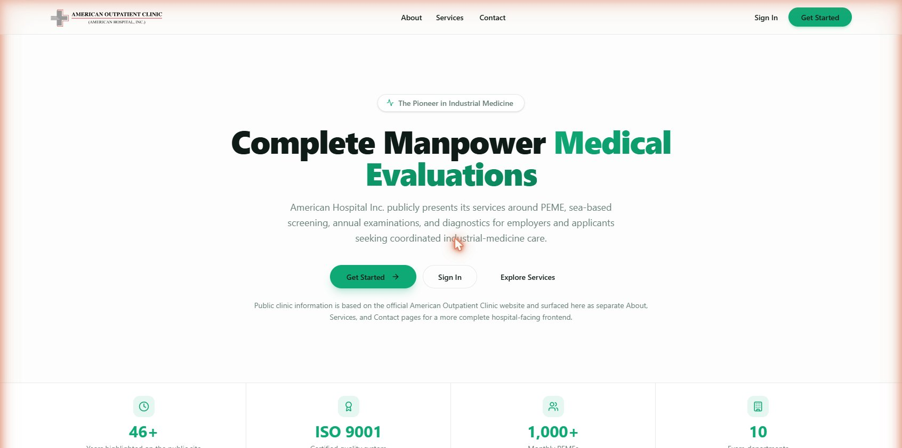

#### 4.3.3.2 About AHI

The About screen presents institutional information about American Hospital Inc. and the scope of the PEME program. It is intended for first-time visitors and for agency users orienting themselves before initiating account creation.

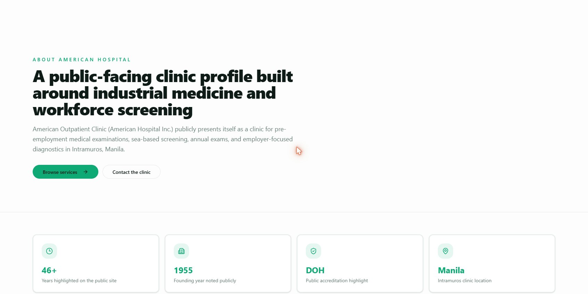

#### 4.3.3.3 Services

The Services screen enumerates the examination packages and the categories of PEME services that AHI offers. It does not expose package internals (for example, which departments a package routes to), which are administrative reference data.

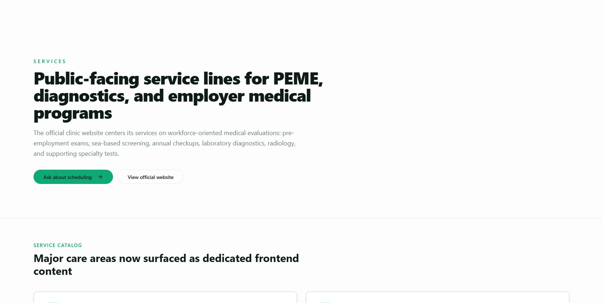

#### 4.3.3.4 Contact

The Contact screen provides AHI's contact channels and is the page from which prospective agency clients are directed to the agency onboarding process.

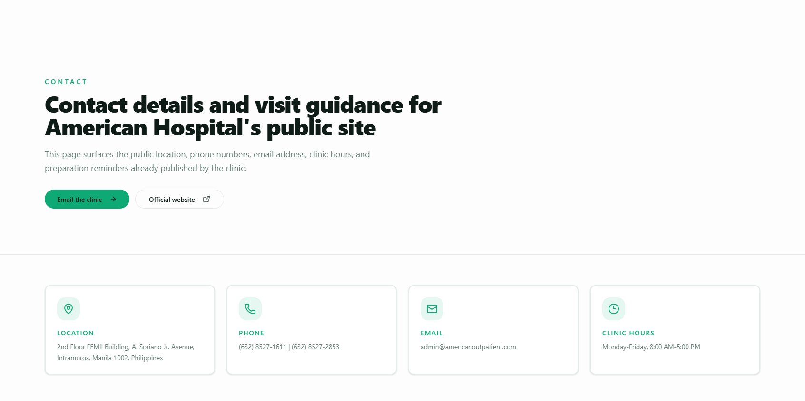

### 4.3.4 Authentication Screens

The authentication branch separates the three actor categories of the system — staff, patient, and agency representative — into distinct sign-in flows. This separation is enforced at the route level so that a staff credential cannot be used at a patient sign-in screen and vice versa, in line with Shneiderman's "prevent errors" rule.

#### 4.3.4.1 Staff Sign-In

The Staff Sign-In screen accepts credentials for the five operational staff roles (reception, triage, department, physician, releasing) and the system administrator. After authentication, the program reads the user's assigned role and routes the user to the correct staff or administrator workspace.

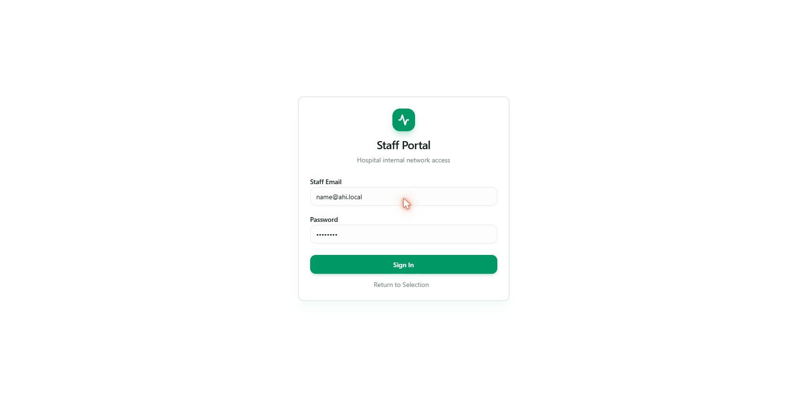

#### 4.3.4.2 Patient Sign-In

The Patient Sign-In screen authenticates a registered patient and routes them to the patient portal.

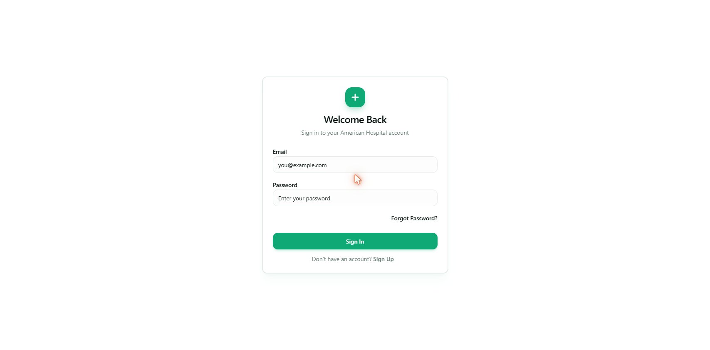

#### 4.3.4.3 Patient Sign-Up

The Patient Sign-Up screen collects the credentials and basic identity fields required to provision a patient account. On successful submission the user is forwarded to the check-email confirmation screen.

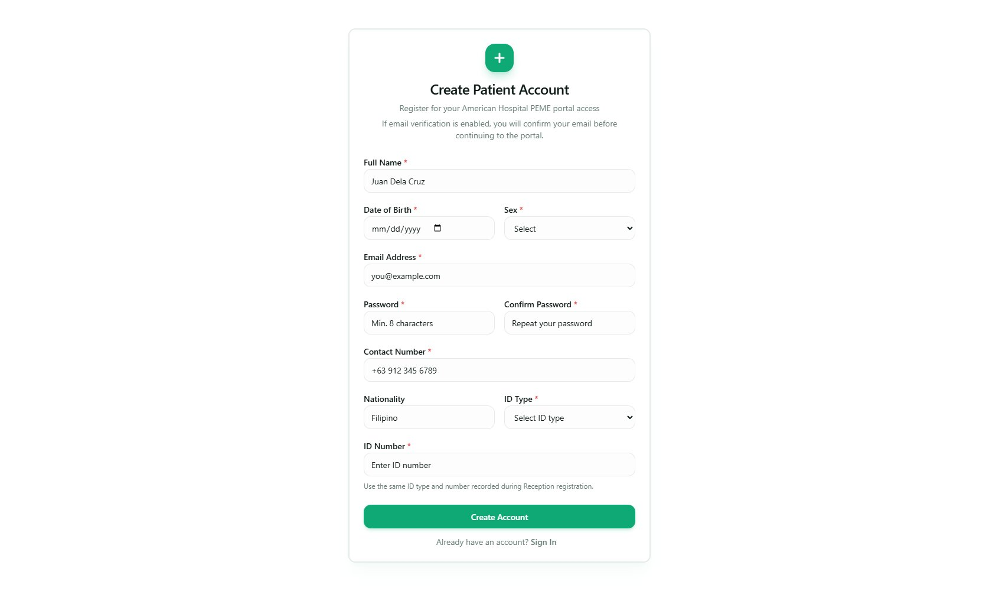

#### 4.3.4.4 Check-Email Confirmation

The check-email screen instructs the newly registered patient to confirm their address from the verification message sent by the authentication service. This screen is also reached after a forgotten-password request.

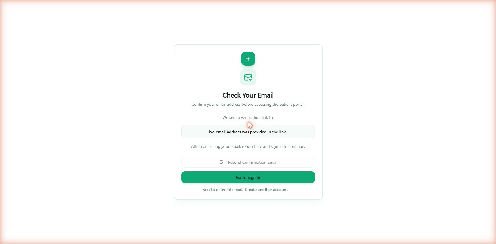

#### 4.3.4.5 Forgot Password

The forgot-password screen accepts the user's e-mail address and triggers the password-reset link delivery. It is rate-limited at the authentication layer to mitigate abuse.

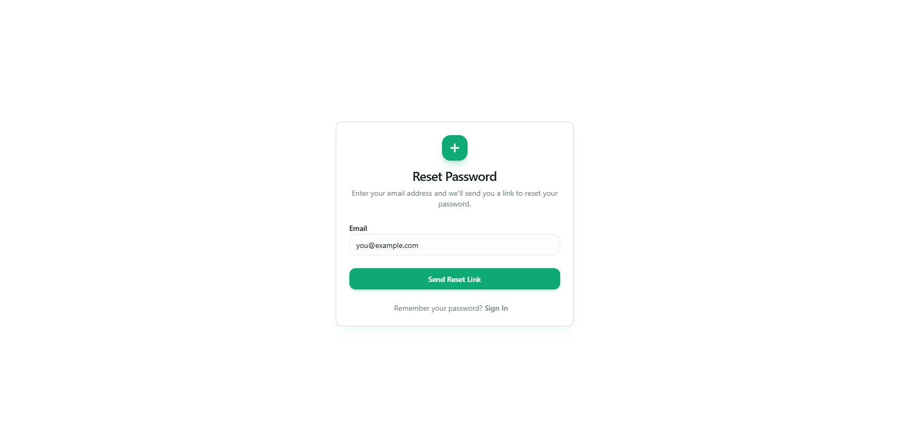

#### 4.3.4.6 Update Password

The update-password screen is reached from the password-reset link and allows the user to set a new password under the system's password policy. On completion, the user is returned to the appropriate sign-in screen.

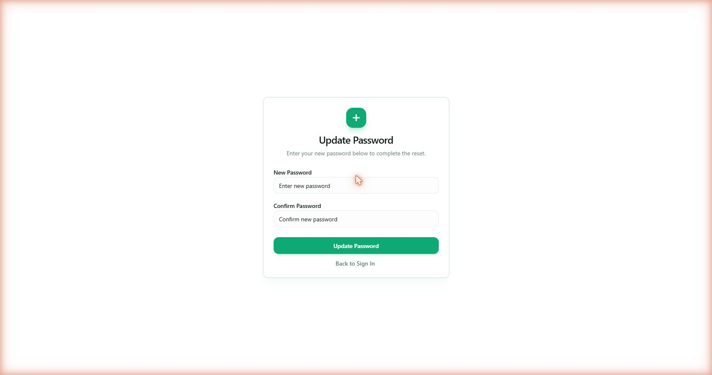

#### 4.3.4.7 Agency (Client Representative) Sign-In

The Agency Sign-In screen authenticates a manpower-agency representative and routes them to the client portal. The flow is segregated from the patient flow because the data-visibility rules enforced after authentication differ materially between the two.

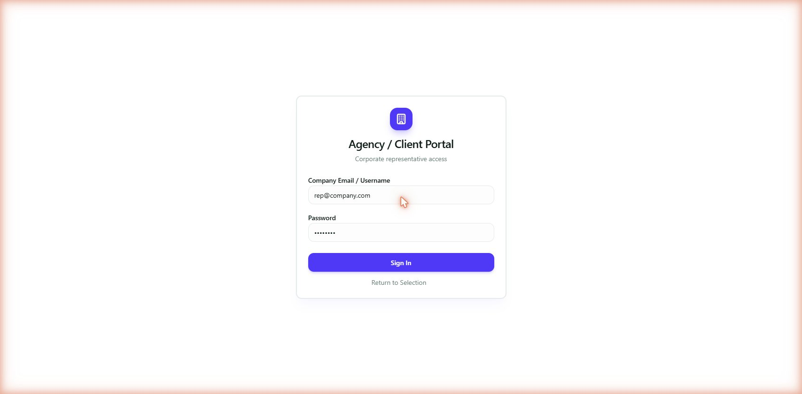

### 4.3.5 Shared Authenticated Surfaces

Every authenticated screen in the program is rendered inside the shared dashboard shell, and every authenticated user has access to the shared account tab. These two surfaces are described once here and are referenced by the role-specific subsections that follow rather than being repeated for each role.

#### 4.3.5.1 Shared Dashboard Shell

The dashboard shell is the layout chrome inside which every role module is rendered. It comprises a top header carrying the page title, a role badge, and quick actions; a left navigation rail exposing only the items relevant to the active role plus the always-available Account and Sign-Out actions; a main content panel; and, on desktop widths, an optional context side panel for recent activity, audit snippets, and short help text. The shell collapses gracefully to a tablet layout (collapsible navigation rail) and a mobile layout (stacked content with a compact header). The shell is also the surface that exposes the persistent return path to the role-correct dashboard from any public page once the user is signed in. Figure 4.12 captures the desktop layout against the Reception/Billing workspace, where the shell elements are most clearly visible alongside a populated case list.

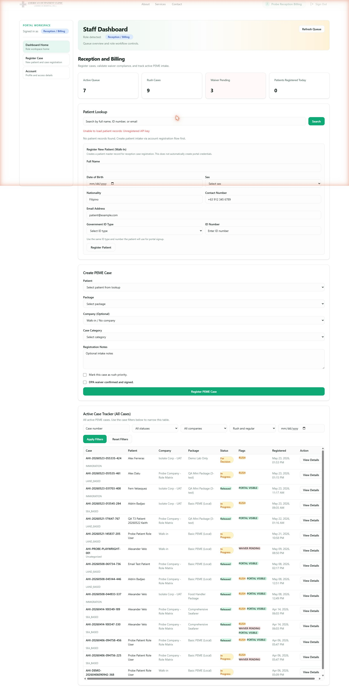

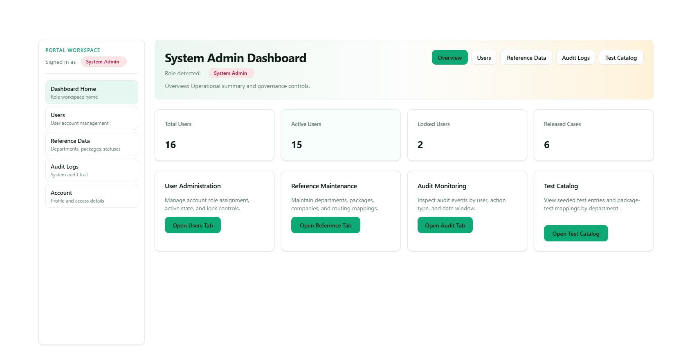

#### 4.3.5.2 Shared Account Tab

The Account tab is the role-agnostic profile and session screen reached from the navigation rail by every authenticated user. It is composed of an identity card (full name, username or e-mail, role), a linked-profile card (patient, company, or department metadata depending on role), a security card (password reset, active and locked indicators, last login), and a session card (current session summary with sign-out). Sensitive identity values are masked by default and missing optional linkage is displayed with explicit fallback labels rather than blank placeholders.

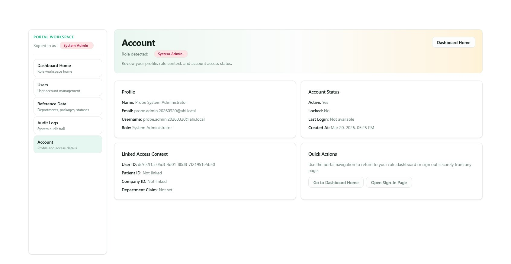

### 4.3.6 Staff Workspace Screens

The staff workspace is the largest branch of the screen tree and is rendered at `/dashboard/staff`. The workspace selects a role module based on the signed-in staff member's assigned role.

#### 4.3.6.1 Reception/Billing Module

The Reception module supports patient search by full name, government-issued identifier, or email address; new patient registration when no existing record matches; and PEME case creation under a chosen company and package, with rush flagging and an explicit waiver-signed confirmation. The registration form constrains the government-identifier field to one of four explicitly enumerated identifier types — Passport, National ID, Driver's License, or Other Government ID — with a per-type validator that checks the format of the supplied value before the record is accepted, so reception cannot save a malformed or ambiguous identifier into the patient registry. On submission, the module displays the generated case number, the initialized case status, and a confirmation panel showing the auto-generated department visits derived from the selected package. An active-case list with filters for status, date, company, and rush flag occupies the main panel, and a soft-cancel action is exposed only for cases in lifecycle states that permit cancellation.

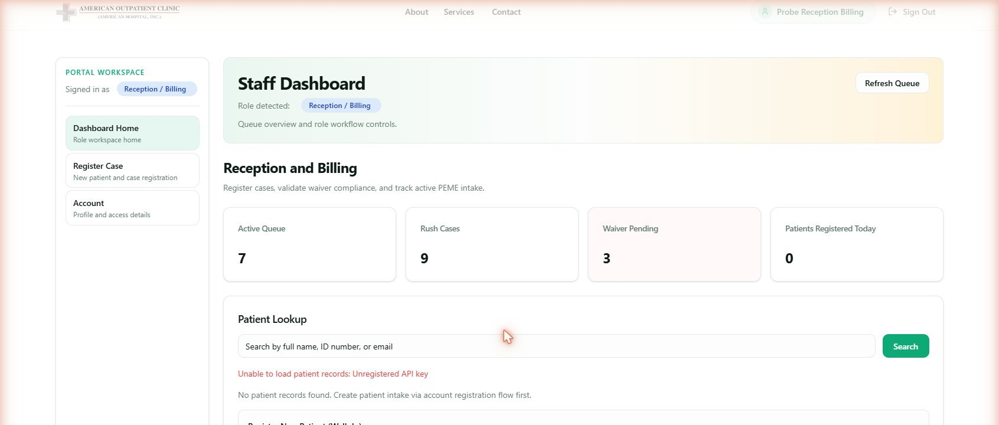

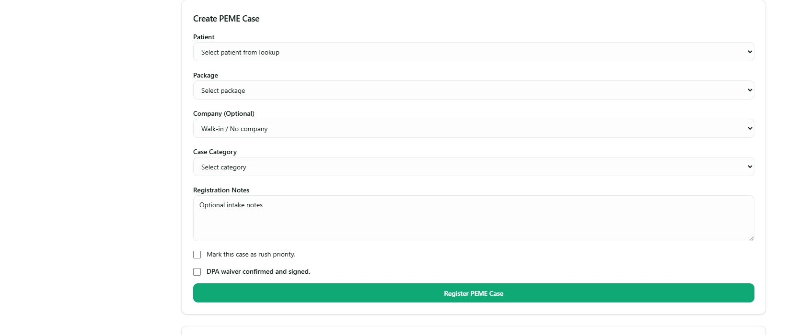

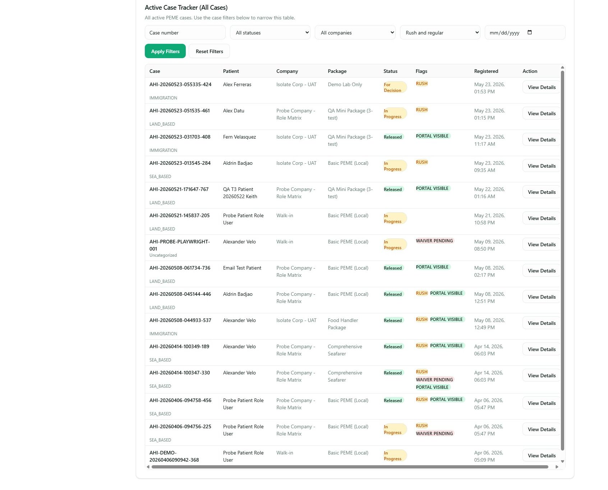

#### 4.3.6.2 Triage Nurse Module

The Triage module presents a queue of cases that have been registered but not yet triaged, with rush-first ordering and quick filters. Selecting a case opens the triage assessment form, which captures vitals and observations and on save transitions the case to In-Progress and stamps the triage completion time. A recent-history panel shows the triage actions the nurse has most recently performed, satisfying the "informative feedback" rule. Figure 4.18 captures the queue in its empty state because the development seed currently contains no cases in the post-registered, pre-triaged window; the assessment form opens as a side panel from the queue when a case is selected.

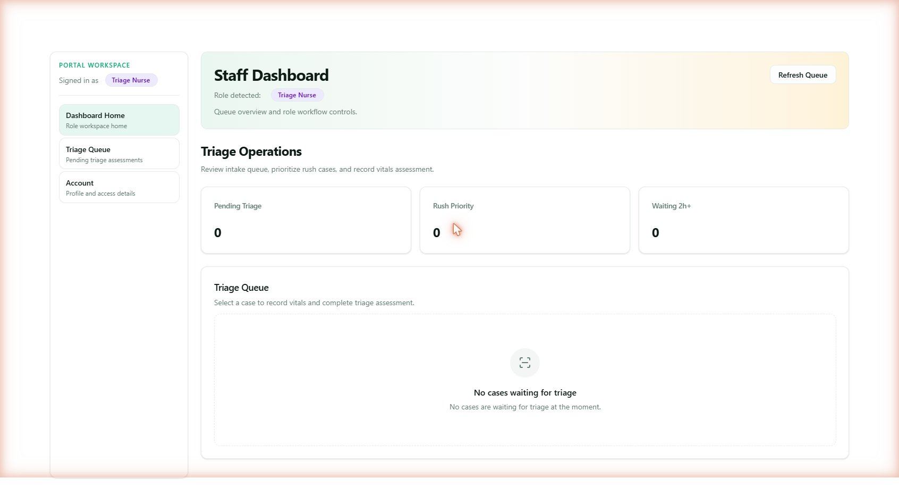

*Figure 4.19 — Triage assessment form. The assessment form is reachable from the queue in Figure 4.18 by selecting a case; the current seed has no cases waiting for triage, so the form cannot be surfaced without first registering a fresh case via the Reception module.*

#### 4.3.6.3 Department Staff Module

The Department module is scoped to the department claim attached to the staff member's account, so a radiology staff member sees only radiology visits and cannot view or act on visits belonging to other departments. The queue exposes a manual-pull table — Pending, In-Progress, Skipped, Completed — and supports the skip-and-requeue path for visits that must be temporarily set aside. The result-encoding form is driven by the seeded Test Catalog introduced in Section 4.1: rather than typing the test name as free text, the staff member selects from a category-grouped dropdown that auto-fills the unit and the reference range for the chosen test, and the form auto-detects abnormal values when the result field loses focus by comparing the entered value against the sex-aware reference range carried by the catalog entry. A required-tests progress panel sits alongside the form and itemizes the package-required tests for the visit, marking each as still outstanding or already encoded, so the staff member has continuous visibility into what must still be recorded before the visit can be completed; required tests cannot be removed from the visit while off-package extras may be added freely, in keeping with the hybrid package-fence rule. A separate result-file upload control allows the staff member to attach scanned diagnostic artifacts; uploaded files are stored in role-scoped storage and surfaced through short-lived signed URLs, and the upload control accepts JPEG, PNG, and PDF files up to ten megabytes.

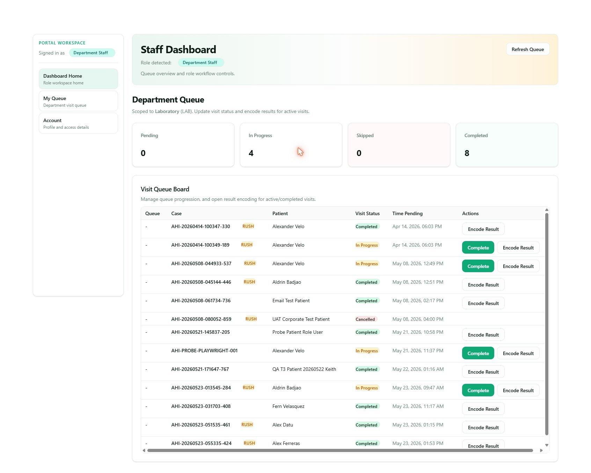

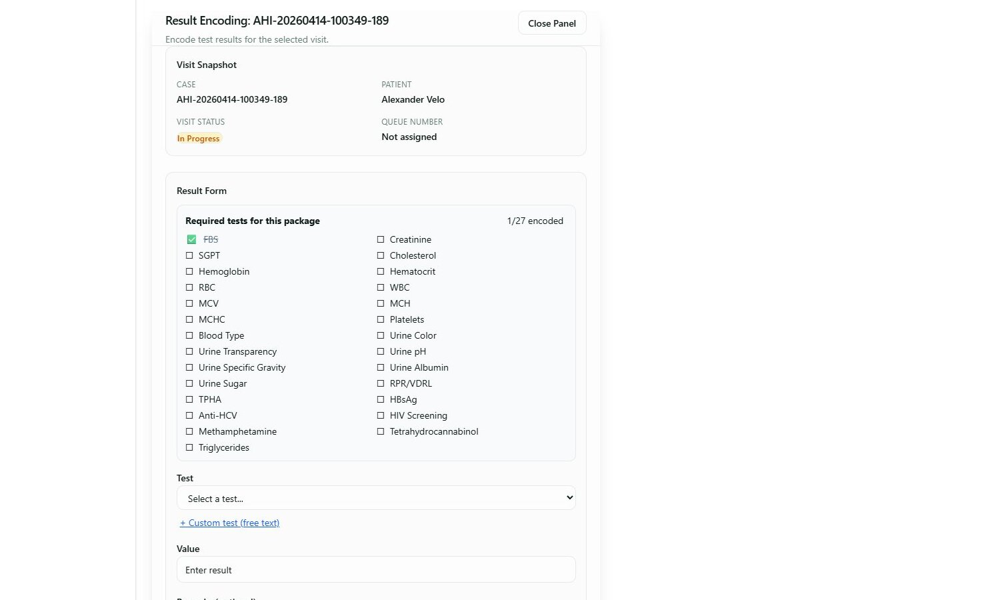

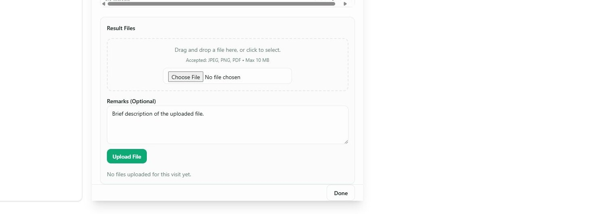

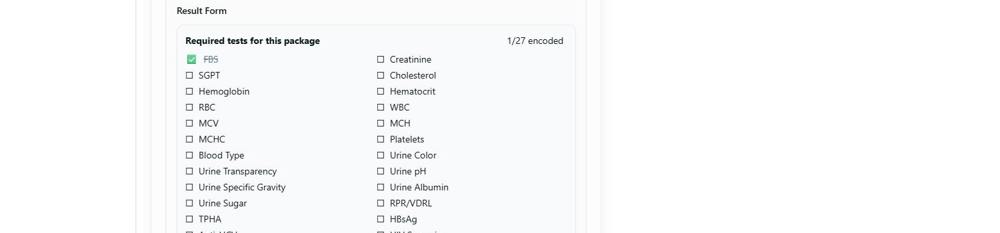

#### 4.3.6.4 Physician Module

The Physician module exposes a queue of cases in the For-Decision state. The queue table includes a Visits column that surfaces a per-case completion percentage derived from the underlying required-visits set; this percentage is computed in a single batched query against the case-progress helper rather than per-row, so the physician can scan the queue and see at a glance which cases are fully encoded and which still have outstanding work. Selecting a case opens a consolidated, read-only summary that aggregates patient identity, the assigned package, and the encoded results from every department, so the physician can render a fitness decision without navigating away. The decision form captures the verdict (Fit, Unfit, or Fit With Restrictions) and free-text remarks, and finalizing the decision transitions the case to For-Releasing. The module also supports a request-additional-tests action that creates new required department visits and returns the case to the Pending Additional Tests state, which is the structural mechanism by which the lifecycle's loop step is honored. Figure 4.24 captures the queue in its empty state because the development seed currently contains no cases in the For-Decision window; the consolidated summary, the decision form, and the additional-tests dialog all surface as panels keyed off the selected queue row.

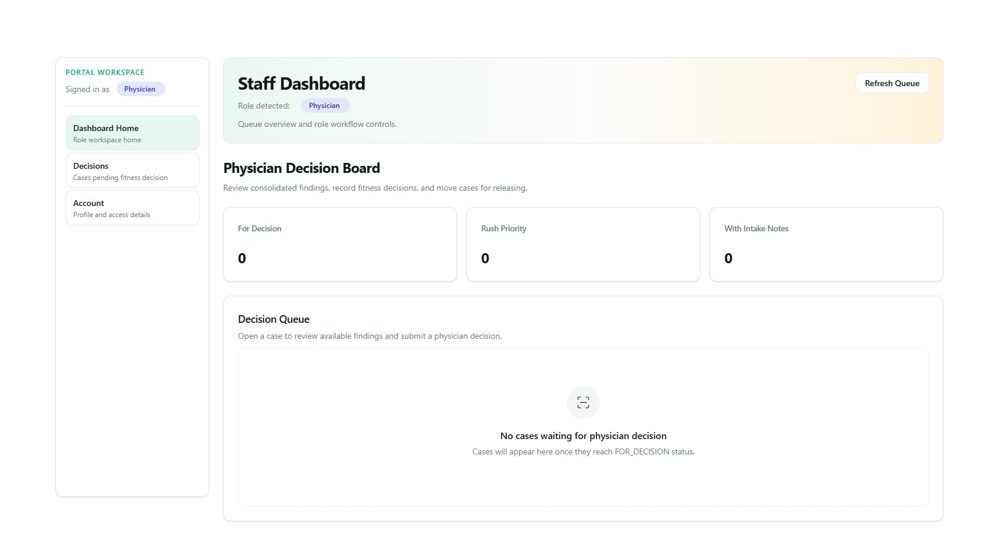

*Figure 4.25 — Physician consolidated case summary. Reachable by selecting a case in the queue in Figure 4.24; current seed has no cases in For-Decision state, so the summary cannot be surfaced without first completing all required visits on an in-progress case.*

*Figure 4.26 — Physician fitness decision form. Same prerequisite as Figure 4.25.*

*Figure 4.27 — Physician request-additional-tests dialog. Same prerequisite as Figure 4.25.*

#### 4.3.6.5 Releasing Staff Module

The Releasing module exposes a queue of cases in the For-Releasing state and gates the release action behind a checklist confirming that all required visits are complete and that a physician decision has been recorded. The release checklist applies a terminal-versus-completed visit rule: only visits in the COMPLETED state satisfy the release gate, while visits in terminal-but-not-releasable states such as CANCELLED or SKIPPED are flagged as blocking with a descriptive per-status error so the releasing staff member understands precisely which visit must be re-encoded or re-routed before the case can be released. The release action sets the case to Released and captures the release timestamp; a separate portal-visibility toggle controls whether the released case is visible in the patient and agency portals and requires a mandatory reason whenever visibility is turned off. A releasing-history panel shows the most recent release and visibility actions performed by the user.

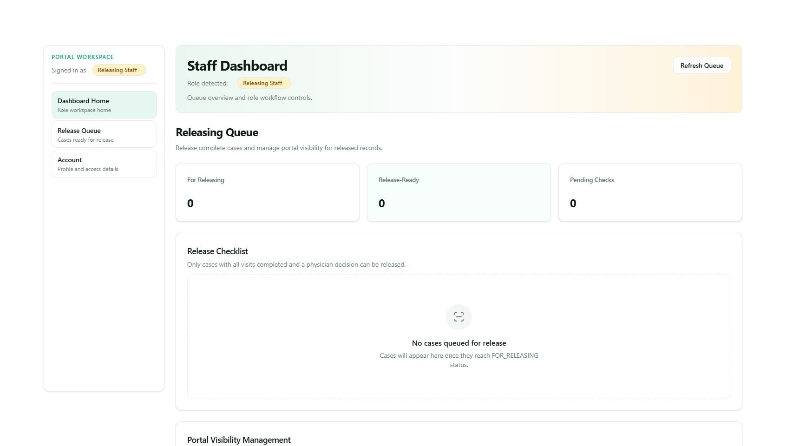

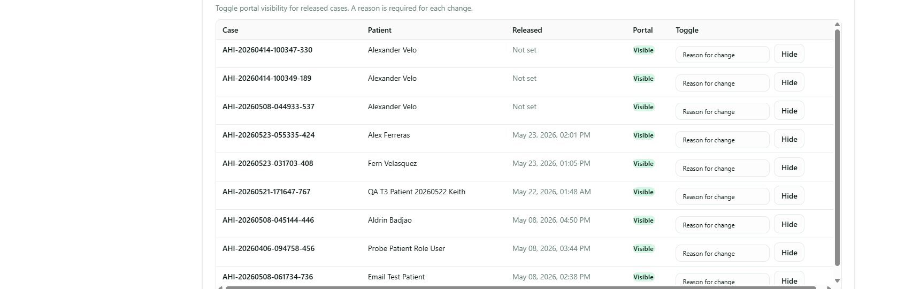


### 4.3.7 System Administrator Workspace Screens

The administrator workspace is rendered at `/dashboard/admin` and supports the platform-governance responsibilities of the System Administrator role.

#### 4.3.7.1 Overview

The Overview tab is the administrator's landing surface inside the workspace and is reached immediately on entry to `/dashboard/admin`. It provides an at-a-glance summary of system-wide state across the four governance areas exposed by the workspace — the user-account table, the reference-data editors, the audit log, and the Test Catalog — and surfaces shortcuts into the corresponding tabs. The Overview tab itself does not perform write actions; it is a navigation and situational-awareness screen, in keeping with Shneiderman's "reduce short-term memory load" rule.

#### 4.3.7.2 User Account Administration

The User Account screen exposes the table of system accounts and allows the administrator to assign roles and to manage the active and locked states of each account.

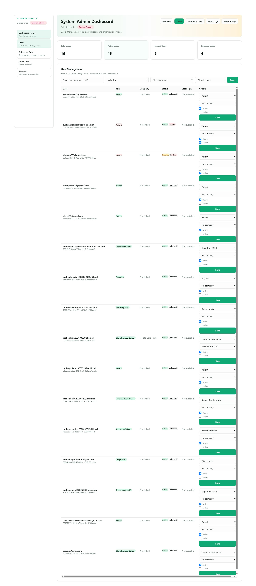

#### 4.3.7.3 Reference Data Management

The reference-data screens allow the administrator to manage departments, examination packages, the package-to-department mapping, status codes, and partner companies. Each editor follows the same shared shell layout and reuses the data-table-container, action-panel, and form components.

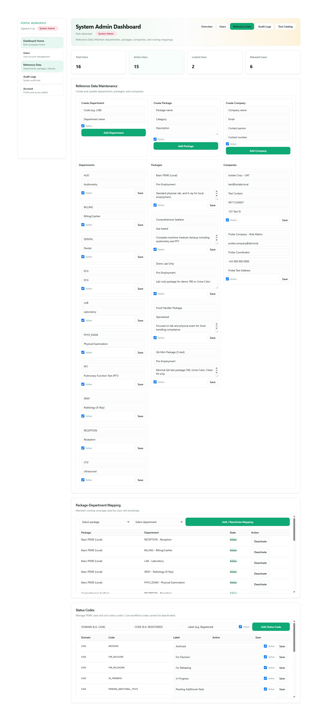

#### 4.3.7.4 Audit Log Viewer

The audit-log viewer surfaces system-wide audit events with filters and supports the compliance review obligations established in Chapter 3.

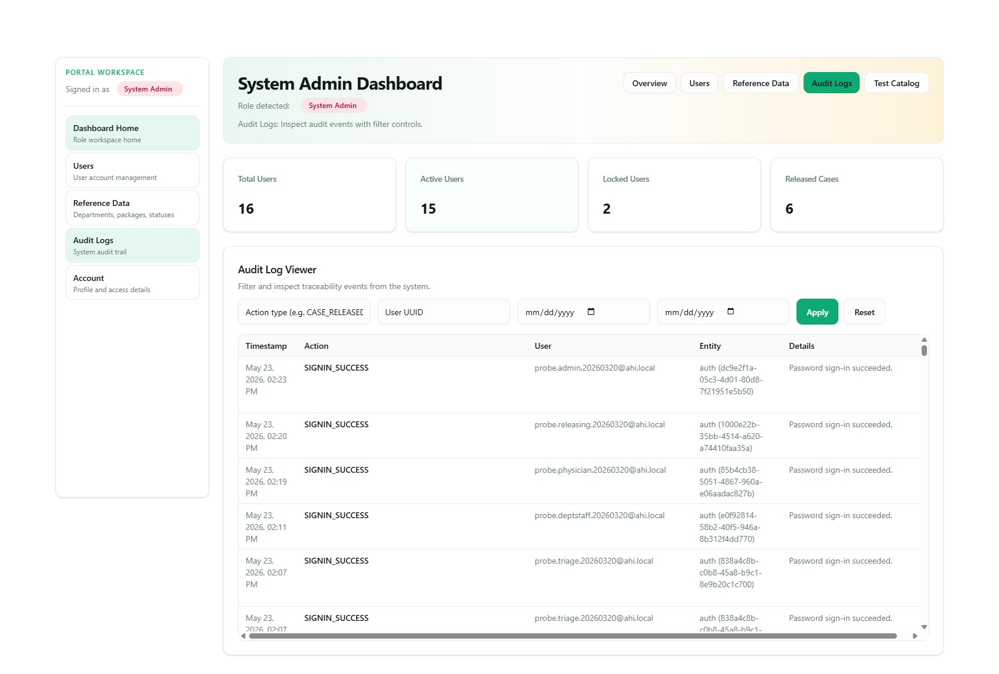

#### 4.3.7.5 Test Catalog

The Test Catalog tab is the administrator's surface for governing the clinical and laboratory tests that the Department Staff result-encoding form is allowed to record. The tab presents the seeded catalog (currently fifty-eight entries) as a single sortable, filterable table grouped by category — for example chemistry, hematology, urinalysis, serology, imaging, drug testing, cardiology, dental, and physical examination — and exposes the per-test attributes that the result-encoding form consumes: the test name, the unit, the sex-aware reference range, the category, and an active flag. From the same tab, the administrator manages the package-to-test mapping that determines which tests are required for each examination package, so a change to a package's required test set propagates to subsequent visits without requiring a code change. The Test Catalog tab is the administrative counterpart to the Department-side encoding experience described in Section 4.3.6.3 and is the surface through which the platform-level Test Catalog feature described in Section 4.1 is governed day-to-day.

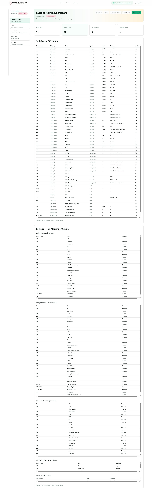

### 4.3.8 Patient Portal Screens

The patient portal is rendered at `/dashboard/patient` and surfaces only the cases belonging to the signed-in patient.

#### 4.3.8.1 Case Tracker

The case tracker is the patient's landing screen and shows the high-level state of the patient's active PEME case in the language of the lifecycle (registered, in progress, for decision, for releasing, released).

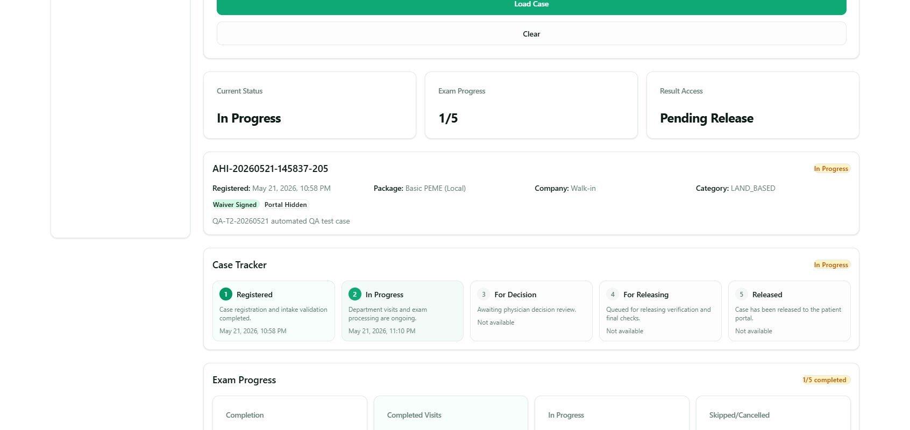

#### 4.3.8.2 Examination Progress

The examination-progress screen breaks the case down to the level of individual required visits and indicates which examinations are pending, in progress, or completed. Clear messaging is presented for cases whose results have not yet been released.

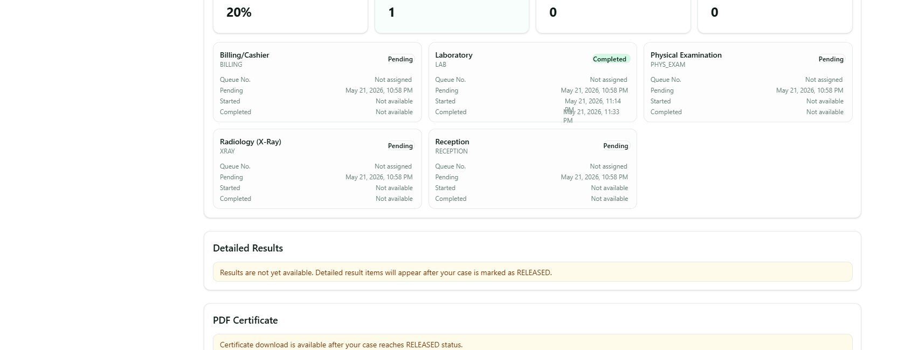

#### 4.3.8.3 Released Result Summary

The released-result summary surfaces the privacy-approved fields of a released case's result. The screen is reachable only when the case is in the Released state and only when releasing has set the portal-visible flag, in line with the four-condition gate established in Section 4.1. Figure 4.37 shows the pre-release placeholder presented to the patient while the case is still in progress.


#### 4.3.8.4 Certificate Download (renderer deferred)

The certificate-download path is the patient's entrypoint for retrieving a downloadable PDF certificate of a released case. The entrypoint screen and the server action that authorizes the download are both implemented — the action validates the patient's role, confirms that the case belongs to the signed-in patient, and verifies that the case is in the Released state before any download is allowed — but the PDF renderer itself is the deferred piece, pending the official AHI certificate template described in Section 4.1. The screen is therefore included in the live tree and is reachable for authorized cases, but the download currently surfaces a placeholder indicating that the certificate is not yet available rather than streaming a generated PDF.


### 4.3.9 Client Representative (Agency) Portal Screens

The client portal is rendered at `/dashboard/client` and is constrained by the four-condition gate of company match, released state, portal-visible flag, and signed waiver.

#### 4.3.9.1 Data Privacy Notice

The Data Privacy Notice screen presents the agency representative with the program's data-privacy commitments and the scope under which case information is being made available. Acknowledgement of this notice precedes access to the search and case-list views.

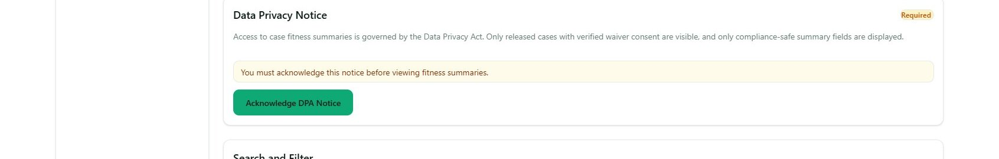

#### 4.3.9.2 Released Case Search

The search panel allows the representative to filter the released-case list by name, case number, identifier, and date range. The search is gated behind the Data Privacy Notice acknowledgement in Section 4.3.9.1, so a representative who has not acknowledged the notice can see the search controls but cannot run a query that yields results.


#### 4.3.9.3 Released Case List

The released-case list shows the cases that satisfy all four visibility conditions for the representative's company and supports filtering by name, date range, and identifier.

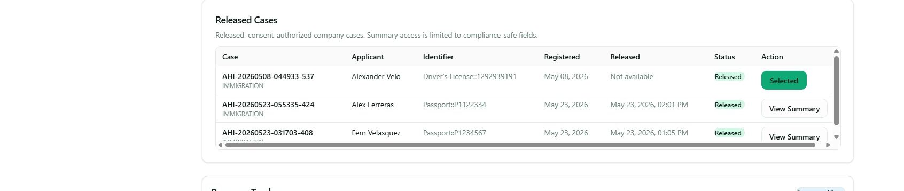

#### 4.3.9.4 Authorized Case Result View

Selecting a case in the list opens the authorized result view, which presents the same privacy-approved fields exposed to the patient. The screen does not expose any field outside the released visibility scope, in keeping with the program's compliance posture.

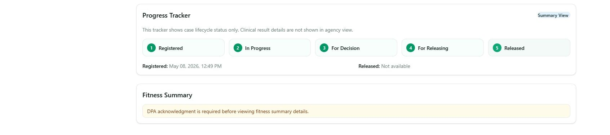

### 4.3.10 System Feedback Screens

#### 4.3.10.1 Unauthorized Access Notice

The unauthorized notice is displayed whenever a user attempts to navigate to a route that is not permitted under their role, or when a department staff member's account is missing a required department claim. The notice carries a reason code (for example, role mismatch or missing department claim) and a return-to-dashboard action. At the time of capture, the runtime rendering of this page is being repaired in the development environment, so Figure 4.43 reflects the intended notice as it appears in the source layout rather than a live capture; the underlying route, source component, and the redirect logic that arrives at it are all in place in `app/unauthorized/page.tsx` and `lib/supabase/middleware.ts`.

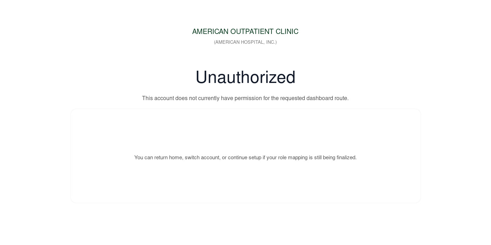

## 4.4 Project Capabilities and Limitations

The Real-Time PEME Monitoring and Result Access System was designed and implemented as a focused, lifecycle-driven web application addressing the specific operational problems identified at American Hospital Inc. This section characterizes the system from a technical standpoint — what the architecture affords in terms of maintainability and extensibility, and where it encounters structural boundaries. The discussion cross-references the scope decisions established in Chapter 1 where relevant, and acknowledges the deferred items identified in Section 4.1 as part of a candid accounting of the system's current state.

### 4.4.1 Technical Capabilities

#### 4.4.1.1 Maintainability

The system's codebase is organized around a clear three-layer separation of concerns — thin route entrypoints in `app/`, feature-level orchestration and server actions in `features/`, and reusable UI primitives in `components/` — which ensures that modifications to one layer do not structurally require changes to another. Reference data such as departments, examination packages, package-to-department mappings, and the Test Catalog are managed entirely through the System Administrator workspace at runtime, without requiring code changes or redeployment. This means that operational changes to AHI's PEME packages — for example, adding a new required test or onboarding a new partner company — can be applied by a non-developer administrator through the existing interface.

The codebase enforces strict TypeScript throughout, with a shared type system derived from the live database schema. This eliminates an entire class of runtime type mismatches and makes the impact of schema changes traceable at compile time rather than discoverable only at runtime. Authorization logic is maintained in two well-defined locations — Row-Level Security policies in the database and middleware guards at the route layer — and any change to access rules needs only to be applied consistently to both layers. The repository's npm script suite (`qa:local`, `qa:ci`, `qa:supabase`) provides a structured pre-commit and pre-merge baseline that a developer can run in under five minutes to confirm that lint rules, type constraints, and test coverage have not regressed. The QA baseline includes the unit suite extended under Sprint B Test Coverage Closure (230 passing tests, 22 skipped real-Supabase integrations) and the Playwright role-routing E2E suite (71 passing, 2 skipped), and the audit-script suite extended under Sprint A Risk Closure now covers terminal visit-state sync, government-identifier uniqueness, open-visit uniqueness, triage RLS, archived-case visibility, the orphan-file sweeper, result-item idempotency, and physician follow-up visibility.

Architectural decisions are recorded in the repository's `memory-bank/decisions.md` log, which documents the rationale behind each structural choice — including the atomic case-bootstrap RPC, the hybrid package-fence rule, the fire-and-forget email pattern, and the session auto-timeout policy. This record reduces onboarding friction for future maintainers who need to understand why a particular pattern was chosen rather than reconstructing intent from code alone.

#### 4.4.1.2 Extensibility

The role routing system is designed to accommodate new user roles with minimal structural work. Role assignments and their corresponding dashboard routing targets are consolidated in `lib/supabase/roles.ts` and `lib/supabase/role-routing.ts`, so adding a new role requires updating those two files and provisioning the corresponding database RLS policies, rather than modifying every authenticated route individually. The existing eight-role model — Reception, Triage, Department Staff, Physician, Releasing, System Administrator, Patient, and Client Representative — can be extended by following the same pattern used by each existing role module.

The email notification pipeline, implemented with Nodemailer over a provider-agnostic SMTP transport, is designed to support substitution of the underlying email provider through environment variable configuration alone. As documented in the decisions log, the Nodemailer codebase is portable across Resend, Postmark, SendGrid, and AWS SES without requiring code modifications, only configuration changes. This means the clinic can transition to a different email provider as its communication infrastructure evolves.

The Test Catalog — a seeded set of approximately sixty clinical and laboratory tests used to drive the department staff's result-encoding form — is managed through the administrator interface and is extensible without code changes. New tests, updated reference ranges, or revised sex-aware normal values can be introduced by the System Administrator, and the changes propagate immediately to the encoding form and to the required-tests progress panel. The package-to-test mapping can similarly be updated at runtime to reflect changes in AHI's examination packages.

The system's database schema is managed through Supabase migrations stored in the `supabase/` directory, providing a versioned and repeatable mechanism for applying schema changes. Any future expansion of the data model — for example, adding structured fields for a new examination type — follows the established migration pattern and is tracked in version control alongside the application code.

#### 4.4.1.3 Security Posture

The system implements a defense-in-depth approach to authorization. Access control is enforced at the database layer through PostgreSQL Row-Level Security policies scoped strictly to each role's data perimeter, and is mirrored at the application layer through Next.js middleware guards on every `/dashboard/*` route. This dual-layer enforcement means that even if the frontend were tampered with or bypassed, unauthorized roles cannot retrieve data belonging to other roles from the underlying database. The patient portal's four-condition visibility gate — requiring a company match, a released case status, a portal-visible flag set by Releasing Staff, and a confirmed data privacy waiver — is enforced at both layers, implementing the Data Privacy Act compliance posture committed to in Chapter 3.

Authentication is hardened with a fifteen-minute idle session auto-timeout, application-layer rate limiting on all `/auth/*` endpoints (ten requests per IP per sixty-second sliding window), and password reset flows protected by the same rate limits. File uploads are restricted to JPEG, PNG, and PDF formats with a ten-megabyte ceiling, with MIME type and size validation enforced at the server action layer rather than relying solely on client-side checks. Uploaded file storage paths follow a structured `{caseId}/{visitId}/{filename}` convention validated against the corresponding `department_visit` record to prevent path traversal. The audit log records login attempts, case creation events, status transitions, release actions, and every email pipeline outcome, providing the forensic trail required for institutional review and privacy compliance.

Security scanning is supported through an OWASP ZAP baseline scan script executed via Docker against the running application, which covers the most common web application vulnerability classes documented in the OWASP Top 10. This is the boundary of the project's security verification capability, as noted in the limitations discussion that follows.

### 4.4.2 Technical Limitations

#### 4.4.2.1 Backend Platform Dependency

The system is architecturally coupled to Supabase as its backend platform. Authentication, the PostgreSQL database, Row-Level Security enforcement, the Realtime subscription channels, and file storage are all provided by Supabase services. While the frontend code interacts with Supabase through a well-defined client interface (`lib/supabase/`), migrating to a different backend — for example, to a self-hosted PostgreSQL instance with a custom authentication service — would require rebuilding the authentication layer, the realtime subscription mechanism, the file storage integration, and all RLS policy definitions. The system was not designed for backend portability, and this coupling is the primary structural constraint on the platform extensibility of the implementation. This decision was made deliberately in Chapter 3 to prioritize development velocity and operational simplicity within the capstone project timeline; the tradeoff is that the clinic's continued use of the system in production depends on Supabase remaining available and on its pricing remaining within the clinic's operational budget.

#### 4.4.2.2 Email Delivery Reliability

The email notification pipeline delivers case-released, decision-recorded, and account-locked notifications to patients, agency representatives, and releasing staff respectively. The pipeline is implemented as a fire-and-forget dispatch from the server action that performs the primary write: a transport failure does not block the case status transition, but also does not trigger an automatic retry. Failed delivery attempts are captured as `EMAIL_FAILED` entries in the audit log, meaning that a staff member or administrator must review the audit log manually to identify and respond to notification failures. There is no built-in retry queue, no dead-letter mechanism, and no user-facing indication when a notification was not delivered. For a clinical setting where agencies and patients depend on email alerts to know when results are available, this pattern introduces a reliability gap that could require manual follow-up in the event of SMTP transport failures.

#### 4.4.2.3 Realtime Subscription Architecture

Real-time queue updates are delivered through a lightweight subscription layer composed of a `useRealtimeRefresh` hook and a `RealtimeBridge` component, which attach Postgres-changes channels to the `peme_case`, `department_visit`, and `result_item` tables and trigger a debounced server-component refresh on relevant row changes. Because the refresh mechanism re-fetches server-rendered data rather than applying an incremental patch, each realtime update produces a full server-side data reload for the affected surface. Under normal operational conditions — 20 to 30 concurrent staff users as established in Chapter 3 — this approach performs adequately. However, under peak loads or in scenarios where many row changes are triggered in rapid succession across multiple cases simultaneously, the debounced refresh pattern could produce a burst of concurrent server requests, which may affect response latency. The system does not include a message queue or backpressure mechanism to regulate refresh frequency under high concurrency.

#### 4.4.2.4 Deferred Features

As identified in Section 4.1, four items from the Chapter 3 design scope remain unimplemented at the time of this writing. The PDF certificate renderer for released cases is awaiting the official AHI certificate template; the download entrypoint and the server action that authorizes and validates the download are implemented, but the renderer itself is pending. The deployment-authorization workflow (SCRUM-38), which formalizes the production-release sign-off process, has not yet been exercised by the application. Parental and guardian consent handling for patients under eighteen years of age has not been added to the patient registration flow and is recorded as future scope. The patient portal's data privacy acknowledgement is currently maintained as a per-session query-state value rather than as a persisted per-user record in the database. A fifth item, email audit-actor propagation, is also deferred pending the active Supabase/Auth/email safety policy. These items do not affect the core operational workflow — case registration, department encoding, physician decisions, and result releasing all function fully — but they represent gaps between the Chapter 3 design commitments and the current build state that must be addressed before the system is considered complete against its original specification.

#### 4.4.2.5 Scope Boundaries Established in Chapter 1

Several capabilities were deliberately excluded from the project's scope in Chapter 1, and these exclusions represent the outer technical boundary of the current implementation. The system does not process financial or billing transactions; while it references billing confirmation status to gate the progression of a case into active examination, it performs no financial data processing and provides no billing management interface. SMS text message alerts, iOS and Android mobile applications, advanced analytics dashboards, integration with national health registries or government systems, and telemedicine capabilities were all identified in Chapter 1 as exclusions. These features were omitted to prioritize the core documented problems — manual status checking, repeated data entry, and delayed result collation — within the development resources and timeline available for a student capstone project. Extending the system to include any of these capabilities would require separate infrastructure planning, integration with external platform APIs, and development resources beyond the current implementation scope.

#### 4.4.2.6 Security Assessment Scope

The project's security verification covers the OWASP ZAP baseline scan and the manual penetration testing procedures described in Chapter 3, which confirm the absence of common web application vulnerabilities. The system does not include a professional security audit by a certified third-party firm, commercial penetration testing services, or advanced threat modeling against sophisticated attacks. This is consistent with the Chapter 3 limitation that such services exceed the budget constraints of a student capstone project. The current security posture is appropriate for a locally-hosted system operating under existing physical security controls and network infrastructure, but organizations seeking to promote the system to a higher-risk production environment should commission a formal third-party security assessment before deployment.
