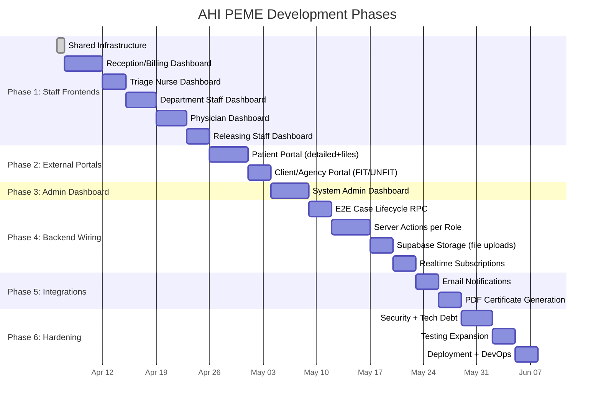

# AHI PEME System — Master Development Plan

**Project:** Real-Time PEME Monitoring and Result Access System for American Hospital Inc.
**Date:** 2026-04-06 (Updated with AHI client answers)
**Current Phase:** Iteration 2, Sprint 07
**Plan Owner:** Keith Avellaneda (Business Analyst & Frontend/Logic Developer)

---

## 1. Project Understanding Summary

American Hospital Inc. (AHI) processes ~1,000 Pre-Employment Medical Examinations (PEME) monthly. This system replaces fragmented paper-based tracking with **role-based dashboards**, **secure portals**, and **real-time workflow visibility** across 10 clinical departments.

### 1.1 System Architecture
- **3-Tier Cloud-Native SPA**: Next.js 15 + React 19 + Tailwind CSS 4 → Supabase BaaS → PostgreSQL
- **8 User Roles**: Reception/Billing, Triage Nurse, Department Staff, Physician, Releasing Staff, System Admin, Patient, Client Representative (Crewing Officer)
- **12 Database Tables**: Core Operational (6) + Security & Audit (3) + Configuration (3)
- **Key Constraints**: No financial processing, no native mobile apps, no SMS, read-only CIS integration

### 1.2 AHI Client-Confirmed Requirements (March 21 Q&A)

> [!IMPORTANT]
> The following requirements are **client-confirmed** from AHI's answered questions. They take precedence over earlier assumptions.

| Requirement | AHI Answer | Impact |
|---|---|---|
| **Patient Portal depth** | Full detailed results + uploaded result files | Patient sees per-department status, result files, fitness decision |
| **Company Portal depth** | FIT/UNFIT only — no clinical detail | Company portal shows only progress + overall fitness status |
| **Access hierarchy** | Patient > Company. Patient access always guaranteed | Company cannot restrict patient results |
| **Consent mechanism** | Physical waiver form signed in-person | Maps to `waiverSigned` flag on `peme_case`. Verified by Reception |
| **Company designated person** | Crewing Officer (screens applicants) | Label company portal user as "Crewing Officer" |
| **Company account model** | One account per company (safer) | Single login per agency. No multi-user company accounts |
| **Result file uploads** | AHI requests patients can see uploaded results | **NEW**: Supabase Storage integration for result file attachments |

> [!WARNING]
> **Sections 2–4 of the AHI questionnaire are NOT YET ANSWERED**: File formats & result types, templates & samples, patient/client onboarding details. These are blockers for PDF template design and result encoding form fields. Follow up with AHI.

### 1.3 What Is Already Built (✅ Done)

| Area | Status |
|---|---|
| Supabase Auth (patient signup/signin) | ✅ Complete |
| SSR session handling + role-aware redirects | ✅ Complete |
| Middleware route guards + RBAC routing | ✅ Complete |
| Dashboard layout shell (navbar, account link) | ✅ Complete |
| Account page (`/dashboard/account`) | ✅ Complete (all roles) |
| Staff dashboard page with role-module router | ✅ Complete (renders correct module per role) |
| 5 Staff role module components (shell UI) | ✅ Built (Reception, Triage, Department, Physician, Releasing) |
| Patient dashboard page | ⚠️ Placeholder only |
| Client dashboard page | ⚠️ Placeholder only |
| Admin dashboard page | ⚠️ Placeholder only |
| Staff/Agency sign-in pages | ✅ Complete |
| Patient sign-in/sign-up/forgot-password pages | ✅ Complete |
| RLS baseline (SELECT + WRITE policies) | ✅ 13 migrations applied |
| Core table indexes | ✅ Applied |
| Package-department mapping table | ✅ Migration applied |
| Vitest QA baseline + GitHub Actions CI | ✅ Running |
| Supabase audit/regression scripts | ✅ Implemented |
| UI component library (Button, Card, Input, Label, Textarea, Sonner) | ✅ Available |
| Shared dashboard components (MetricCard, StatusBadge, LoadingSkeleton, EmptyState, ErrorState, RoleBadge) | ✅ Built |
| Dashboard constants + nav config | ✅ Built |

### 1.4 What Still Needs To Be Built (❌ / ⚠️)

| Area | Status |
|---|---|
| **Reception module**: Live case creation → auto-visit bootstrap | ⚠️ UI shell exists, server actions partial |
| **Triage module**: Triage form with vitals encoding | ⚠️ UI shell exists, no data write flow |
| **Department module**: Result encoding form + visit status transitions + **result file upload** | ⚠️ UI shell exists, no result_item write, no file upload |
| **Physician module**: Decision form + additional test requests | ⚠️ UI shell exists, no peme_decision write |
| **Releasing module**: Release action + portal visibility toggle | ⚠️ UI shell exists, no release write path |
| **Admin dashboard**: User/role/reference data management | ❌ Placeholder only |
| **Patient portal**: Case progress tracker + **uploaded result files** + released results | ❌ Placeholder only |
| **Client/Agency portal**: **FIT/UNFIT only** + progress view + consent-gated access | ❌ Placeholder only |
| E2E Case Lifecycle RPC (visit auto-bootstrap) | ❌ Not implemented |
| Realtime WebSocket subscriptions | ❌ Not implemented |
| **Supabase Storage (result file uploads)** | ❌ Not implemented (NEW) |
| PDF certificate generation | ❌ Not implemented (blocked by AHI Section 2–3 answers) |
| Email notifications (SMTP) | ❌ Not implemented |
| Session auto-timeout (15 min) | ❌ Not implemented |
| Rate limiting on auth endpoints | ❌ Not implemented |
| OWASP ZAP security scan integration | ❌ Not implemented |

---

## 2. Development Philosophy & Prioritization

```
PRIORITY ORDER:
═══════════════════════════════════════════════════════════
  1. FRONTEND DASHBOARDS (per role)          ← YOU ARE HERE
  2. Backend data flows (Server Actions + RPCs)
  3. Result file upload (Supabase Storage)   ← NEW
  4. Integration features (Realtime, Email, PDF)
  5. Security hardening & tech debt
  6. Testing & QA expansion
  7. Deployment & DevOps
  8. Polish, performance & compliance
═══════════════════════════════════════════════════════════
```

> [!IMPORTANT]
> **Frontend-first strategy**: Build the visible UI for each role dashboard FIRST, then wire the backend data flows behind them. This ensures stakeholders can see and validate the interface before the backend logic is finalized.

---

## 3. Phased Development Roadmap



---

## 4. Phase 1 — Staff Role Frontend Dashboards (PRIORITY)

> **Goal**: Transform every staff role module from shell/placeholder into a fully-featured, data-driven dashboard UI.

### 4.1 Shared Dashboard Infrastructure (✅ DONE)

| # | Task | Status |
|---|---|---|
| 1.0.1–1.0.5 | LoadingSkeleton, EmptyState, ErrorState, StatusBadge enhancement, RoleBadge | ✅ Built |
| 1.0.9 | Dashboard nav config (`lib/dashboard/nav-config.ts`) | ✅ Built |
| 1.0.10 | Dashboard constants (`lib/content/dashboard-constants.ts`) | ✅ Built |

**Remaining shared work:**

| # | Task | Files Affected | Details |
|---|---|---|---|
| 1.0.6 | `DashboardHeader` component | `components/dashboard/shell/dashboard-header.tsx` [NEW] | Page title, role badge, quick-action buttons |
| 1.0.7 | `DataTableContainer` component | `components/dashboard/shared/data-table-container.tsx` [NEW] | Sortable, filterable table wrapper with pagination |
| 1.0.8 | `ActionPanel` component | `components/dashboard/shared/action-panel.tsx` [NEW] | Slide-over or modal panel for forms and detail views |

---

### 4.2 Reception/Billing Dashboard (~5 days)

**Primary Goal**: Register and initialize PEME cases safely and quickly.

#### Frontend Components

| # | Component | Description |
|---|---|---|
| 1.1.1 | `reception/patient-search.tsx` | Search by name, DOB, government ID/passport. Results table. |
| 1.1.2 | `reception/patient-form.tsx` | New patient registration (name, DOB, sex, nationality, contact, email, gov ID). |
| 1.1.3 | `reception/case-form.tsx` | Company selector, package selector, category, rush flag, **waiver signed checkbox** (AHI: physical waiver verified in-person). |
| 1.1.4 | `reception/case-success.tsx` | Shows generated case number, initialized status, department visits created. |
| 1.1.5 | `reception/case-list.tsx` | Active case list filterable by status, date, company, rush. Paginated. |
| 1.1.6 | `reception/case-detail.tsx` | Expandable case info + visit status summary. |
| 1.1.7 | `reception/cancel-action.tsx` | Cancel with confirmation dialog, only in allowed states. |
| 1.1.8 | Metric Cards Row | Total cases today, rush cases, pending triage, completed today. |
| 1.1.9 | Refactor `reception-module.tsx` | Wire sub-components, remove inline content. |

#### Server Actions Needed
- `searchPatients(query)` — search patients
- `createPatient(data)` — create new patient record
- `createCase(data)` — create case + auto-bootstrap department visits
- `cancelCase(caseId)` — soft-cancel a case

---

### 4.3 Triage Nurse Dashboard (~3 days)

**Primary Goal**: Record triage data and advance case to operational workflow.

#### Frontend Components

| # | Component | Description |
|---|---|---|
| 1.2.1 | `triage/triage-queue.tsx` | Cases in REGISTERED/IN_PROGRESS where triage pending. Rush-first sorting. |
| 1.2.2 | `triage/triage-form.tsx` | Vital signs (BP, HR, temp, weight, height), vision, observations. |
| 1.2.3 | `triage/triage-complete.tsx` | Confirmation with timestamp. |
| 1.2.4 | Quick Filters | Toggle rush-only vs all. |
| 1.2.5 | Metric Cards Row | Pending, in-progress, completed today. |
| 1.2.6 | Refactor `triage-module.tsx` | Wire sub-components. |

#### Server Actions Needed
- `fetchTriageQueue()` — get cases pending triage
- `submitTriageAssessment(caseId, data)` — encode vitals, mark triage complete

---

### 4.4 Department Staff Dashboard (~4 days)

**Primary Goal**: Execute department visits, encode exam results, **upload result files**.

> [!IMPORTANT]
> **AHI NEW**: Department staff need ability to upload result files (images, PDFs, scans) per visit. These files will be visible to patients in their portal.

#### Frontend Components

| # | Component | Description |
|---|---|---|
| 1.3.1 | `department/dept-queue.tsx` | Pending visits for assigned department. Rush-first, then TimePending. |
| 1.3.2 | `department/visit-controls.tsx` | Status transitions: Pending→In_Progress, In_Progress→Completed, Pending→Skipped, Skipped→Pending. |
| 1.3.3 | `department/result-form.tsx` | Dynamic form: test name, value, unit, reference range, abnormal flag. |
| 1.3.4 | **`department/file-upload.tsx`** [NEW] | **Upload result files (images, PDFs) per visit. Uses Supabase Storage. Drag-and-drop or click-to-upload UI.** |
| 1.3.5 | `department/completed-list.tsx` | Read-only summary of completed visits today. |
| 1.3.6 | `department/activity-timeline.tsx` | Recent department actions log. |
| 1.3.7 | Metric Cards Row | Pending, in-progress, completed, skipped counts. |
| 1.3.8 | Refactor `department-module.tsx` | Wire sub-components, enforce department_id claim filtering. |

#### Server Actions Needed
- `fetchDepartmentQueue(departmentId)` — get pending visits
- `updateVisitStatus(visitId, newStatus)` — transition visit state
- `saveResultItems(visitId, items[])` — encode result records
- **`uploadResultFile(visitId, file)`** — upload to Supabase Storage [NEW]
- `skipVisit(visitId)` / `requeueVisit(visitId)` — skip/requeue

---

### 4.5 Physician Dashboard (~4 days)

**Primary Goal**: Review consolidated results and make fitness decisions.

#### Frontend Components

| # | Component | Description |
|---|---|---|
| 1.4.1 | `physician/decision-queue.tsx` | Cases in FOR_DECISION status. |
| 1.4.2 | `physician/case-summary.tsx` | Full read-only view: demographics, company, package, all results grouped by department, **uploaded result files**. |
| 1.4.3 | `physician/decision-form.tsx` | FIT / UNFIT / FIT_WITH_RESTRICTIONS + remarks. |
| 1.4.4 | `physician/additional-tests.tsx` | Department multi-select → new department_visit records. |
| 1.4.5 | `physician/decision-confirm.tsx` | Success after submission. |
| 1.4.6 | Metric Cards Row | Pending decisions, decided today, additional tests requested. |
| 1.4.7 | Refactor `physician-module.tsx` | Wire sub-components. |

#### Server Actions Needed
- `fetchDecisionQueue()` — cases for decision
- `fetchCaseSummary(caseId)` — full consolidated data + **file attachments**
- `submitDecision(caseId, data)` — write peme_decision, advance status
- `requestAdditionalTests(caseId, departmentIds[])` — create new visits

---

### 4.6 Releasing Staff Dashboard (~3 days)

**Primary Goal**: Release only complete and approved cases.

#### Frontend Components

| # | Component | Description |
|---|---|---|
| 1.5.1 | `releasing/release-queue.tsx` | Cases in FOR_RELEASING status. |
| 1.5.2 | `releasing/release-checklist.tsx` | Auto-checks: all visits complete? Decision present? |
| 1.5.3 | `releasing/release-action.tsx` | Finalize → RELEASED, portalVisible=true, timestamp. |
| 1.5.4 | `releasing/visibility-toggle.tsx` | Toggle with mandatory reason + audit. |
| 1.5.5 | `releasing/released-list.tsx` | Today's released cases. |
| 1.5.6 | Metric Cards Row | Pending release, released today, portal-visible count. |
| 1.5.7 | Refactor `releasing-module.tsx` | Wire sub-components. |

#### Server Actions Needed
- `fetchReleaseQueue()` — cases for releasing
- `releaseCase(caseId)` — set status, timestamp, portalVisible
- `togglePortalVisibility(caseId, visible, reason)` — toggle + audit

---

## 5. Phase 2 — External Portal Frontends

### 5.1 Patient Portal Dashboard (~5 days)

> [!IMPORTANT]
> **AHI-confirmed scope**: Patient sees detailed results INCLUDING uploaded result files. Fitness status (FIT/UNFIT) prominently displayed. Patient access is **always guaranteed** — company cannot restrict it.

#### Frontend Components

| # | Component | Description |
|---|---|---|
| 2.1.1 | `patient/case-tracker.tsx` | Visual timeline: Registered → In Progress → For Decision → For Release → Released. |
| 2.1.2 | `patient/exam-progress.tsx` | Required department visits with completion badges per department. |
| 2.1.3 | `patient/result-summary.tsx` | **Detailed** result view — privacy-approved fields, fitness status prominently shown. |
| 2.1.4 | **`patient/result-files.tsx`** [NEW] | **List and download/view uploaded result files per department.** Supabase Storage signed URLs. |
| 2.1.5 | `patient/availability-message.tsx` | Clear "Results not yet available" for unreleased cases. |
| 2.1.6 | `patient/pdf-download.tsx` | Download/print certificate (when backend available). |
| 2.1.7 | Refactor `patient/page.tsx` | Replace placeholder cards with live components. |

#### Data Requirements (RLS: own case only)
- `peme_case` where `patientid` matches user
- `department_visit` completion statuses
- `result_item` — **full detail** for patient (all fields)
- **Result files from Supabase Storage** — signed URLs per visit
- `peme_decision` fitness status (if released)

#### Design Notes
- **Mobile-first responsive** (360–428px viewport)
- Minimum 44×44px touch targets
- FCP < 2s on 4G
- Always accessible — company cannot block

---

### 5.2 Client/Agency Portal Dashboard (~3 days)

> [!IMPORTANT]
> **AHI-confirmed scope**: Company sees **ONLY FIT/UNFIT** — no in-depth clinical results. Progress/status visibility only. One account per company (Crewing Officer). Consent-gated via physical waiver.

#### Frontend Components

| # | Component | Description |
|---|---|---|
| 2.2.1 | `client/released-cases.tsx` | Own company, RELEASED, portalVisible=true, waiverSigned=true. Shows **FIT/UNFIT badge only**. |
| 2.2.2 | `client/case-search.tsx` | By applicant name, passport number, date range. |
| 2.2.3 | `client/dpa-notice.tsx` | Standardized DPA compliance notice before viewing any results. |
| 2.2.4 | `client/case-result-view.tsx` | **Summary only**: demographics, fitness status (FIT/UNFIT), decision remarks. **NO clinical detail, NO result_item data, NO uploaded files.** |
| 2.2.5 | `client/progress-tracker.tsx` [NEW] | **Applicant progress view** — which stage the case is at (without clinical detail). |
| 2.2.6 | Refactor `client/page.tsx` | Replace placeholder with live components. Label user as "Crewing Officer". |

#### Data Requirements (RLS: own company only)
- `peme_case` where `companyid` matches AND `RELEASED` AND `portalvisible` AND `waiversigned`
- `patient` join for demographics (name only)
- `peme_decision.fitnessstatus` — **FIT/UNFIT only**
- `peme_decision.remarks` — physician remarks
- **NO `result_item` access** — RLS must block
- **NO file download access** — Storage policy must block

#### Design Notes
- **Mobile-first responsive**
- DPA notice mandatory before any viewing
- Access blocked if `waiverSigned = false`
- UI label: "Crewing Officer Portal" / "Company Portal"
- One login per company

---

## 6. Phase 3 — System Administrator Dashboard (~5 days)

**Primary Goal**: Full administrative control over users, reference data, and audit logs.

| # | Component | Description |
|---|---|---|
| 3.1.1 | `admin/user-table.tsx` | All users with role, status, last login. Lock/unlock, deactivate. |
| 3.1.2 | `admin/user-form.tsx` | Role assignment, company/patient linking, active status. |
| 3.1.3 | `admin/department-manager.tsx` | CRUD departments (soft-delete). |
| 3.1.4 | `admin/package-manager.tsx` | CRUD packages. |
| 3.1.5 | `admin/package-dept-mapping.tsx` | Visual editor: departments per package. |
| 3.1.6 | `admin/status-code-manager.tsx` | CASE, VISIT, DECISION domain management. |
| 3.1.7 | `admin/company-manager.tsx` | CRUD company/agency records. **One account per company** enforced. |
| 3.1.8 | `admin/audit-log-viewer.tsx` | Filterable by date, user, action. Paginated. |
| 3.1.9 | Admin Metric Cards | Total users, active cases, today's actions. |
| 3.1.10 | Refactor `admin/page.tsx` | Tabbed admin interface. |

---

## 7. Phase 4 — Backend Data Flow Wiring

### 7.1 E2E Case Lifecycle RPC (~3 days)

| # | Task | Description |
|---|---|---|
| 4.1.1 | Design `bootstrap_peme_case` RPC | Transactionally create `peme_case` + all `department_visit` rows from `package_department` mapping. |
| 4.1.2 | Write migration | `supabase/migrations/YYYYMMDD_bootstrap_case_rpc.sql` |
| 4.1.3 | Wire Server Action | `createCase()` calls the RPC |
| 4.1.4 | Test with Reception UI | Verify full flow |

### 7.2 Server Actions Per Role (~5 days)

| # | Role | Actions |
|---|---|---|
| 4.2.1 | Reception | `searchPatients`, `createPatient`, `createCase`, `cancelCase` |
| 4.2.2 | Triage | `fetchTriageQueue`, `submitTriageAssessment` |
| 4.2.3 | Department | `fetchDepartmentQueue`, `updateVisitStatus`, `saveResultItems`, **`uploadResultFile`**, `skipVisit`, `requeueVisit` |
| 4.2.4 | Physician | `fetchDecisionQueue`, `fetchCaseSummary`, `submitDecision`, `requestAdditionalTests` |
| 4.2.5 | Releasing | `fetchReleaseQueue`, `releaseCase`, `togglePortalVisibility` |
| 4.2.6 | Admin | `manageUsers`, `manageDepartments`, `managePackages`, `manageCompanies`, `fetchAuditLogs` |
| 4.2.7 | Patient | `fetchOwnCase`, `fetchOwnResults`, **`fetchResultFiles`** |
| 4.2.8 | Client | `fetchReleasedCases`, `fetchCaseFitness` (**FIT/UNFIT only — no result_item**) |

### 7.3 Supabase Storage — Result File Uploads (~3 days) [NEW]

> [!IMPORTANT]
> New cross-cutting feature driven by AHI's request for patients to see uploaded results.

| # | Task | Description |
|---|---|---|
| 4.3.1 | Create Storage bucket | `result-files` bucket with RLS policies |
| 4.3.2 | Upload policy | Department Staff can upload to `/{caseId}/{visitId}/` path |
| 4.3.3 | Read policy (Patient) | Patient can read files for own case only |
| 4.3.4 | Read policy (Physician) | Physician can read files for FOR_DECISION cases |
| 4.3.5 | **Block policy (Company)** | **Company/Agency CANNOT access files** (AHI: no clinical detail for company) |
| 4.3.6 | File metadata table | Optional `result_file` table tracking uploads per visit |

### 7.4 Realtime WebSocket Subscriptions (~3 days)

| # | Task | Description |
|---|---|---|
| 4.4.1 | Department queue listener | Auto-refresh on new visits or status changes |
| 4.4.2 | Triage queue listener | Auto-refresh on case registration |
| 4.4.3 | Physician queue listener | Auto-refresh when all visits complete |
| 4.4.4 | Release queue listener | Auto-refresh when decision made |
| 4.4.5 | Patient portal listener | Live progress updates for own case |

---

## 8. Phase 5 — Integration Features

### 8.1 Email Notifications (~3 days)

| # | Task | Description |
|---|---|---|
| 5.1.1 | SMTP configuration | Env vars for SMTP server, port, credentials |
| 5.1.2 | Email templates | Case completion, result availability, portal access |
| 5.1.3 | Trigger on release | Auto-send to patient + **crewing officer** when released |
| 5.1.4 | No sensitive data in body | Portal login link only |

### 8.2 PDF Certificate Generation (~3 days)

> [!WARNING]
> **BLOCKED** by AHI Sections 2–3 (file formats, templates, branding). Cannot finalize PDF design until AHI provides sample templates, branding requirements, and digital signature needs.

| # | Task | Description |
|---|---|---|
| 5.2.1 | PDF template design | Waiting on AHI template samples |
| 5.2.2 | Server-side generation | Edge Function or API route |
| 5.2.3 | Download endpoint | Authenticated, role-gated. Patient gets full certificate. **Company gets summary only (FIT/UNFIT).** |
| 5.2.4 | Transmittal summary | Per-company batch for releasing staff |

---

## 9. Phase 6 — Security Hardening & Tech Debt

### 9.1 Security Enhancements (~4 days)

| # | Task | Reference |
|---|---|---|
| 6.1.1 | Session auto-timeout (15 min) | SCRUM-56 |
| 6.1.2 | Forgot password integration | SCRUM-53 |
| 6.1.3 | Rate limiting on `/auth/*` | SCRUM-54 |
| 6.1.4 | Probe credential hardening | SCRUM-55 |
| 6.1.5 | Convert bootstrap SQL to .mjs | SCRUM-55 |
| 6.1.6 | ZAP scan script | SCRUM-59 |

### 9.2 Testing Expansion (~3 days)

| # | Task | Description |
|---|---|---|
| 6.2.1 | Server action unit tests | Tests for all role server actions |
| 6.2.2 | Dashboard component tests | Render tests with mocked data |
| 6.2.3 | Browser E2E tests | Login + dashboard flow per role |
| 6.2.4 | **Storage upload tests** | Verify file upload/download and RLS policies |
| 6.2.5 | Coverage threshold | Raise to 80% for auth/role code |

### 9.3 Deployment & DevOps (~3 days)

| # | Task | Description |
|---|---|---|
| 6.3.1 | Vercel deployment config | Production environment |
| 6.3.2 | Env variable management | Staging vs production |
| 6.3.3 | CI/CD enhancement | E2E + security scans in pipeline |
| 6.3.4 | Docker fallback docs | On-premises guide |

---

## 10. Phase 7 — Polish, Performance & Compliance

| # | Task | Description |
|---|---|---|
| 7.1 | Performance audit | < 3s load, ≤ 50 concurrent users |
| 7.2 | Accessibility audit | WCAG 2.1 AA |
| 7.3 | Mobile responsiveness QA | 360–428px viewports |
| 7.4 | DPA compliance validation | Consent flows, **company sees no clinical detail** |
| 7.5 | ISO 9001 documentation | Record management docs |
| 7.6 | SUS usability testing | Target ≥ 68 |
| 7.7 | Security penetration test | OWASP Top 10 |

---

## 11. Team Assignment Matrix

| Phase | Keith (Frontend/Logic) | Clark (Backend/Architect) | Alexander (DevOps/Compliance) |
|---|---|---|---|
| **Phase 1** | Staff dashboard UI components | Server Actions + RPC design | QA scripts + component tests |
| **Phase 2** | Patient + Client portal UI | RLS refinement (block company from result_item) | DPA compliance notice |
| **Phase 3** | Admin dashboard UI | Admin server actions | Audit log viewer + export |
| **Phase 4** | Wire UI to actions + file upload UI | E2E RPC + **Storage bucket + policies** | CI/CD for E2E tests |
| **Phase 5** | Email template layouts | SMTP + PDF generation | Security scanning |
| **Phase 6** | Session timeout + password reset UI | Rate limiting | ZAP + deployment |
| **Phase 7** | SUS testing + mobile QA | Performance optimization | Compliance docs |

---

## 12. Risk Register

| Risk | Impact | Mitigation |
|---|---|---|
| **AHI Sections 2–4 unanswered** | Blocks PDF templates, result encoding form design, onboarding flows | Follow up immediately. Build UI with flexible/generic fields first |
| Package-department mapping data incomplete | Blocks case auto-bootstrap | Verify seed data with AHI |
| RLS policies too restrictive for new queries | Blocks frontend data | Test every query in staging |
| **Company seeing clinical detail (data leak)** | DPA violation | RLS must block `result_item` + Storage for company role. Verify with probe tests |
| Team bandwidth bottleneck on Clark | Delays backend | Keith + Alexander take frontend-adjacent actions |
| Email SMTP access unavailable | Blocks notifications | Make email optional |
| PDF library selection delayed | Blocks certificate generation | Prototype with `@react-pdf/renderer` |

---

## 13. Pending AHI Follow-Up Items

> [!CAUTION]
> These unanswered items from the March 21 questionnaire are **blockers** for specific features. Follow up with AHI as soon as possible.

| Section | Key Questions Pending | What It Blocks |
|---|---|---|
| **File Format & Result Types** | What result types? What formats? DICOM/JPG/PNG? | Result file upload UI, Storage bucket config, file viewer component |
| **Templates & Samples** | Sample templates? Branding? Digital signatures? Draft vs finalized? **Package-to-exam list?** | PDF generation, result encoding form fields, package_department seed data |
| **Patient/Client Onboarding** | Current company list? How patients sign up? Required fields? | Registration form validation, company seed data, onboarding flow |

---

## 14. Definition of Done (Per Phase)

- [ ] All UI components render with real or well-mocked data
- [ ] Empty, loading, and error states for every data view
- [ ] Role guards verified — no cross-role data leaks
- [ ] **Company portal cannot see clinical detail** (AHI requirement)
- [ ] **Patient portal shows uploaded result files** (AHI requirement)
- [ ] `npm run qa:local` passes
- [ ] Memory bank updated
- [ ] Code reviewed by team member

---

## 15. Immediate Next Steps

1. **NOW**: Continue building Phase 1 shared infrastructure (DashboardHeader, DataTableContainer, ActionPanel)
2. **Sprint A**: Build Reception/Billing dashboard UI (§4.2)
3. **Parallel**: Clark begins E2E case lifecycle RPC design
4. **URGENT**: Follow up with AHI for Sections 2–4 answers
5. **Continuous**: Update `memory-bank/activeContext.md` as phases complete
